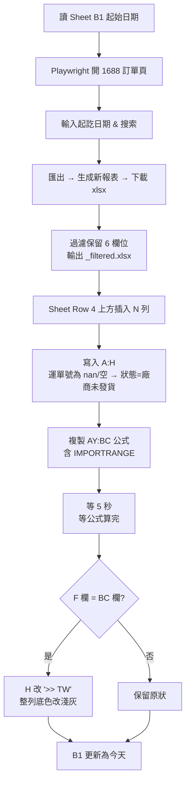

# 1688 訂單同步

從 1688 後台抓訂單、過濾後推到 Google Sheet「運單對照(beta)」。可一鍵執行或從網頁觸發。

## 流程



### 文字版

1. 讀 Sheet B1 的起始日期
2. 用 Playwright 開 1688 訂單頁、設日期、匯出 Excel
3. 過濾保留 6 個欄位（訂單編號 / 狀態 / 建立時間 / 付款時間 / 收件人 / 運單號）
4. 在 Sheet 第 4 列上方插入新列、寫入 A:H、複製 AY:BC 公式
5. 等公式算完、比對 F 與 BC，匹配的列把 H 改 `>> TW`、整列底色改淺灰
6. B1 更新為今天

## 環境需求

- Python 3.10+
- Windows（subprocess 編碼設定針對 Windows）
- Playwright + Chromium：`playwright install chromium`
- 套件：`pandas`、`flask`、`playwright`、`google-auth-oauthlib`、`google-api-python-client`

## 第一次使用

1. 把 Google OAuth `client_secret_*.json` 放在專案根目錄
2. 登入 1688 並存 cookies：

   ```
   python login_and_save.py
   ```

   會產生 `1688_state.json` / `storage_state.json`

3. 第一次跑 `main.py` 會開瀏覽器走 Google OAuth，產生 `token_rw.pickle`

## 執行方式

### 一鍵 CLI

```
python main.py
```

### 網頁介面（推薦）

```
python app.py
```

打開 <http://127.0.0.1:8000>，按「開始執行」，log 會即時串流到頁面。

## 主要檔案

| 檔案 | 用途 |
| --- | --- |
| `main.py` | 一鍵主流程：抓訂單 → 過濾 → 推 Sheet |
| `app.py` | Flask 網頁介面，按鈕觸發 `main.py` |
| `update_sheet.py` | 獨立腳本：只把 `_filtered.xlsx` 推到 Sheet |
| `login_and_save.py` | 登入 1688 並存 cookies/storage state |
| `fetch_sheet.py` | 讀 Sheet 內容（除錯用） |
| `inspect_target_sheet.py` | 檢查目標分頁結構（除錯用） |

## 設定常數（`main.py` 上方）

- `SPREADSHEET_ID`：目標 Sheet ID
- `SHEET_NAME`：分頁名稱（預設 `運單對照(beta)`）
- `KEEP_COLUMNS`：過濾後保留欄位
- `COL_F` / `COL_H` / `COL_BC` / `FORMULA_START` / `FORMULA_END`：欄位 index

## 注意事項

- 1688 cookies 會過期，過期後重跑 `login_and_save.py`
- 下載的 xlsx 檔會留在專案目錄（含 `_filtered.xlsx`）
- 運單號為空或 `nan` 時：F 欄留空、G 欄不寫日期、H 欄記為「廠商未發貨」
